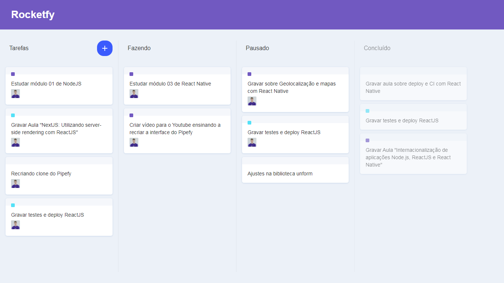

 

<h1 align='center'>
      clone-pipefy
</h1>

 

<h1 align="center">
    
</h1>

<h2 title='#projeto'>
    Descrição
</h2>

Projeto desenvolvido na aula "Recriando Pipefy do zero (com drag n' drop) | Diego Fernandes", da Rocketseat